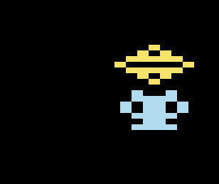

# firefly-zig

Firefly is a 2D Game API and engine strongly based on ECS design. Uses [raylib](https://github.com/raysan5/raylib) under the hood 

Note: Firefly is under heavy development and way far from release or completed feature set. 

TODO: 
    - Error handling
        - IO Tasks (File load/save, Tasks, Assets...) should have error handling possibilities
        - Other Components and Entities do not need special error handling just global error handler for:
            - unreachable (usually allocs)
            - panics 
            - others?

    Allocation handling
        - Use new arena allocators where possible and when it makes sense
        - For Component-Fields and EntityComponent-Fields that needs allocation, consider overall pool allocation just like for components itself

Features:

    - [x] utils - geometry utilities
    - [x] utils - DynArray, DynIndexArray and DynIndexMap for index mapping
    - [x] utils - Event and EventDispatcher for define and using events
    - [x] utils - Aspects, Aspect Groups and Kind (TODO Aspects Mixin?)
    - [x] utils - Bitset and Bit-Mask

    - [x] api - NamePool to store arbitrary names on the heap
    - [x] api - Components, Entities/Components, Systems (with Mixins)
    - [x] api - Attributes Component and CallContext (with Mixins)
    - [x] api - Composite Component(with Mixin)
    - [x] api - Assets Component (with Mixin)
    - [x] api - Control Component (with Mixin)
    - [x] api - Trigger Component
    - [x] api - Task Component
    - [x] api - State Engine Component
    - [x] api - State Engine and Entity State Engine Components

    - [x] graphics - Shader
    - [x] graphics - Texture Asset
    - [x] graphics - View and Layer Components
    - [x] graphics - Transform Entity Component
    - [x] graphics - Sprites Entity Component
    - [x] graphics - Tiles and TileMap Component
    - [x] graphics - Text Entity Component
    - [x] graphics - Shapes Entity Component

    - [x] physics - Animation
    - [x] physics - Movement 
    - [x] physics - Collision-Detection
    - [x] physics - Collision-Resolving
    - [ ] physics - Ray-Cast
    - [x] physics - Audio
    
    - [x] game - Behavior 
    - [x] game - TileSet (created in code or loaded from JSON file)
    - [x] game - TileMap (created in code or loaded from JSON file)
    - [x] game - Camera (simple pivot camera)
    - [x] game - Player 
    - [x] game - Platformer - Jump / Move Control and Collision Resolver
    - [x] game - Platformer - Area (created in code or loaded from JSON file)
    - [x] game - Platformer - Room (created in code or loaded from JSON file)
    - [ ] game - Adaptable main View that fits to different screens without losing resolution


 ## Code Example:



``` zig
_ = Texture.Component.newActive(.{
    .name = "TestTexture",
    .resource = "resources/logo.png",
    .is_mipmap = false,
});

const sprite_id = SpriteTemplate.Component.new(.{
    .texture_name = "TestTexture",
    .texture_bounds = utils.RectF{ 0, 0, 32, 32 },
});

_ = Entity.newActive(.{ .name = "TestEntity" }, .{
        ETransform{
            .position = .{ 64, 164 },
            .scale = .{ 4, 4 },
            .pivot = .{ 16, 16 },
            .rotation = 180,
        },
        ESprite{ .template_id = sprite_id },
        EEasingAnimation{
            .duration = 1000,
            .looping = true,
            .inverse_on_loop = true,
            .active_on_init = true,
            .loop_callback = loopCallback1,
            .start_value = 164.0,
            .end_value = 264.0,
            .easing = Easing.Linear,
            .property_ref = ETransform.Property.XPos,
        },
        EEasingAnimation{
            .duration = 2000,
            .looping = true,
            .inverse_on_loop = true,
            .active_on_init = true,
            .start_value = 0.0,
            .end_value = 180.0,
            .easing = Easing.Linear,
            .property_ref = ETransform.Property.Rotation,
        },
    });
```

 ## Platformer essentials and Room loading from JSON file now working:

 

